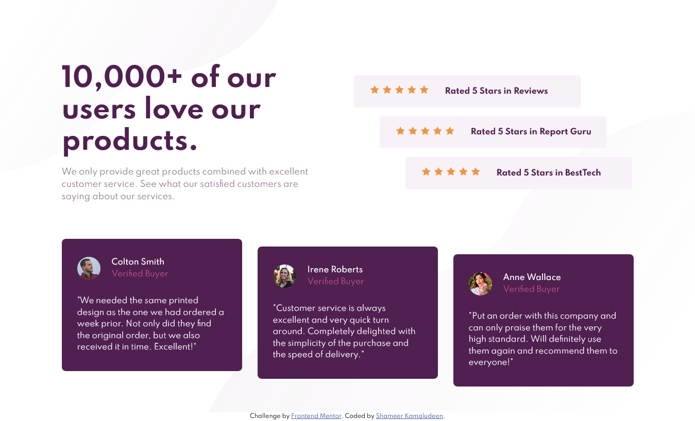

# Frontend Mentor - Social proof section solution

This is a solution to the [Social proof section challenge on Frontend Mentor](https://www.frontendmentor.io/challenges/social-proof-section-6e0qTv_bA). Frontend Mentor challenges help you improve your coding skills by building realistic projects. 

## Table of contents

- [Overview](#overview)
  - [The challenge](#the-challenge)
  - [Screenshot](#screenshot)
  - [Links](#links)
- [My process](#my-process)
  - [Built with](#built-with)
  - [What I learned](#what-i-learned)
  - [Continued development](#continued-development)
  - [Useful resources](#useful-resources)
- [Author](#author)
- [Acknowledgments](#acknowledgments)

## Overview

This challenge helped me learn and practice more about layout. Being able to use both grid and flexbox was another advantage of the challenge. It made me rethink the layout design.

### The challenge

Users should be able to:

- View the optimal layout for the section depending on their device's screen size

### Screenshot

### Links

- Solution URL: [Click here](https://github.com/shameerkamaludeen/social-proof-section)
- Live Site URL: [Click here](https://shameerkamaludeen.github.io/social-proof-section/)

## My process

This challenge was helped to rethink designing a more concrete layout. The following changes were made in my design skills.

- Started to focus on designing first to the last element on a mobile-first workflow. 
- First started designing for a particular responsive width of the screen, for example, 480px width screen then increase the width to a 769px width screen and checked any design breaks, if so, fix it with media query and then move next device width.
- Started to think of a grid in someplace we required to use flexbox because it works more consistently.

### Built with

- Semantic HTML5 markup
- Flexbox
- CSS Grid
- Mobile-first workflow

### What I learned

- Started familiarising grid
- Layout design improvement, focus on first to last element instead of focus on the random element based on which breaking in responsive width.
- Even though some layout is done with the flexbox replacing it with a grid become more consistent

### Continued development

- Layout design practice with less time, which is more important because I noticed most time are spent on fixing layout issues.

### Useful resources

- [Set column width to content length in CSS Grid](https://stackoverflow.com/q/47171214/3877538) - This helped me fix some of the layout issues I faced while using the grid.

## Author

- Github - [Shameer Kamaludeen](https://github.com/shameerkamaludeen)
- Frontend Mentor - [@shameerkamaludeen](https://www.frontendmentor.io/profile/shameerkamaludeen)

## Acknowledgments

I am really thankful for Frontend Mentor, on this time they helped me with some of the most important layout designs and made me start thinking of the best way to design them.